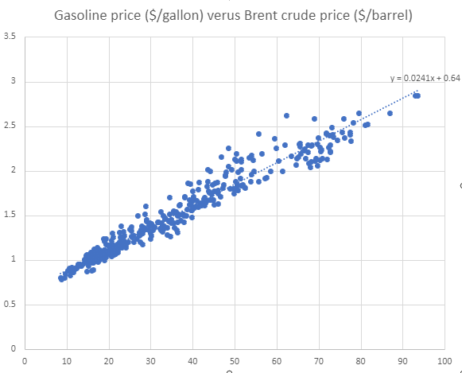

Parameterizing the OPEX-CAPEX model
================
Last updated by Jordan Wingenroth on
01/08/24

## Parameterizing value functions

### Overview

We intend to run our OPEX-CAPEX model for realistic scenarios. The most
important parameters we need to determine are $\sigma_f$, $\sigma_g$,
$\mu_f$, and $\mu_g$, which represent uncertanty and drift values for
future “green” CAPEX ($k_g$) and “fossil” OPEX ($c_f$). We will also
want to tune other parameters and ranges for OPEX and CAPEX costs to be
as realistic as possible, including fossil CAPEX ($k_f$) and green OPEX
($c_g$), which are constants in the current version of our model. We are
planning to present results for two scenarios: power plants and cars.

Our main source is the Rhodium Climate Outlook, which was just released
a couple weeks ago (November 30, 2023). We got these values from the
authors:

|                                      | Year | Mean    | StdDv  | 2022 value | Min    | Max     | Unit      |
|--------------------------------------|------|---------|--------|------------|--------|---------|-----------|
| Brent Crude Oil Price                | 2030 | 88.08   | 43.46  | 100.90     | 29.62  | 155.21  | \$/barrel |
| Henry Hub Natural Gas Price          | 2030 | 3.28    | 1.30   | 6.45       | 1.31   | 6.00    | \$/mmbtu  |
| Solar Overnight Capital Cost         | 2050 | 632.00  | 198.71 | 1458.61    | 287.58 | 980.19  | \$/kW     |
| Wind Land Overnight Capital Cost     | 2050 | 928.00  | 291.76 | 1519.08    | 422.28 | 1439.25 | \$/kW     |
| Wind Offshore Overnight Capital Cost | 2050 | 1718.00 | 712.65 | 5029.64    | 667.27 | 2868.02 | \$/kW     |
| EV Batteries                         | 2050 | 112.00  | 86.88  | 240.83     | 16.67  | 234.67  | \$/kWh    |

### Power plants

We’re going to compare onshore wind (green) with natural gas (fossil).
The “Wind Land Overnight Capital Cost” row above provides present-day
and 2050 prices for capital expense per kW of green power generation,
which will inform our $k_g$ variable. We will use the “Henry Hub Natural
Gas Price” to calculate $c_f$, although because 2022 was a price spike,
we will use the average of all of the 2023 monthly data currently
available in the [FRED](https://fred.stlouisfed.org/series/MHHNGSP)
database. We also plan to incorporate fixed O&M expenses in the CAPEX
figures, and some dimensional analysis is required to get to units that
can be meaningfully compared between the two technologies.

#### $\mu$ and $\sigma$

These parameters are unitless and do not require dimensional analysis.
The [NREL ATB](https://atb.nrel.gov/electricity/2023/land-based_wind)
estimates fixed O&M values to decline over time, with pretty high
uncertainty, so it seems wrong to assume the same values for present and
future $k_g$, so I am going to ignore that for this part.

``` r
mu_formula <- function(x, x0, t, t0) log(x/x0)/(t-t0) # Adapted from "Model Documentation.docx"
sigma_formula <- function(x, sd_x, t, t0) sqrt(log((sd_x/x)^2 + 1)/(t-t0))

### k_g ###

k_g         = 928                   # 2050 value
k_g_0       = 1519.08               # 2022 value
sd_k_g      = 291.7610619           # StdDv in 2050
t_g         = 2050
t_g_0       = 2022

mu_k_g      = mu_formula(k_g, k_g_0, t_g, t_g_0)
sigma_k_g   = sigma_formula(k_g, sd_k_g, t_g, t_g_0)

### c_f ###

FRED_HH_values <- c(3.27, 2.38, 2.31, 2.16, 2.15, 2.18, 2.55, 2.58, 2.64, 2.98, 2.71) # Jan to Nov

c_f         = 3.27788226897         # 2030 value
c_f_0       = mean(FRED_HH_values)  # Average of 2023 monthly values
sd_c_f      = 1.30384615402         # StdDv in 2030
t_f         = 2030          
t_f_0       = 2023

mu_c_f      = mu_formula(c_f, c_f_0, t_f, t_f_0)
sigma_c_f   = sigma_formula(c_f, sd_c_f, t_f, t_f_0)
```

This results in the following estimates:

| Variable | Drift ($\mu$) | Volatility ($\sigma$) |
|:---------|:--------------|:----------------------|
| $k_g$    | -0.0176       | 0.05802               |
| $c_f$    | 0.03659       | 0.14486               |

#### $k$ values

To convert units for $k$ values from \$/kW to investment cost for a
plant, we will make assumptions about capacity factor and the generation
($q$) size of the plant, and we will add in fixed O&M costs. Capacity
factors come from [Waiting for
Clarity](https://www.rff.org/publications/reports/waiting-for-clarity-how-a-price-on-carbon-can-inspire-investment/),
the 2021 report authored by Brian and his colleagues. We’ll run the
Monte Carlo simulation for a wide range of starting values for $k_g$ but
it would be good to have one, probably the central one, match the actual
value from Rhodium. We want to keep everything in the same start year,
so we will adjust that $k_{g,0}$ starting value to 2023 to match the
$c_{f,0}$ year, using the drift calculated above from the Rhodium
values.

We also need our $k_f$ value, which we will get from the [NREL Annual
Technology
Baseline](https://atb.nrel.gov/electricity/2023/fossil_energy_technologies),
specifically using the values for “NG Combined Cycle” plants. They have
two specifications for those plants, “H-Frame” and “F-Frame”, and their
starting year is 2021, so their 2023 projections are slightly uncertain.
I will use estimates in the center of their range for now, for both
CAPEX and fixed O&M costs, as well as for green fixed O&M costs. We can
change this later if need be, but it seems like it will have a
negligible effect.

Side note: code chunks in this document use variables from earlier
chunks.

``` r
dr              = 0.1                        # Our model uses a 10% discount rate
T               = 10                         # Our model assumes plants last 10 years
q               = 1                          # Our model assumes generation of 1 million MWh/year

# Convert $/kW to total cost in millions of $ (where q is in millions of MWh/year)
k_unit_conversion <- function(k, onm, CF, dr, T, q) {

    k_plus_onm  = k + sum(onm*(1-dr)^(1:T))  # Add in fixed O&M
    k_millionMW = k_plus_onm * 1000          # $/kW to millions of dollars per million MW
    k_capacity  = k_millionMW/CF             # Need to build 1/CF units for 1 unit of generation
    k_milMWh_yr = k_capacity / 8760          # $1 per million MW = $1/8760 per million MWh/year

    return(k_milMWh_yr)    
}

k_g_2023        = exp(log(k_g_0) + mu_k_g)   # Estimate 2023 value from 2022 value
k_f_2023        = mean(c(1234.2, 1274.6))

onm_g_2023      = mean(c(28.8, 29.9))           # In $/kW-year units
onm_f_2023      = mean(c(30.4, 30.9))

CF_g            = .409
CF_f            = .550

k_g_adj         = k_unit_conversion(k_g_2023, onm_g_2023, CF_g, dr, T, q)
k_f_adj         = k_unit_conversion(k_f_2023, onm_f_2023, CF_f, dr, T, q)
```

This lands us at $k_{g,0}$ = \$464.61 million and $k_f$ = \$297.65
million.

We address future decline in $k_g$ as part of our model, but we assume a
constant $k_f$, which seems like it might bias results in favor of wind
based on the NREL ATB projections.

#### $c$ values

Converting operating expenses is easier in terms of units. All we need
to do to get from the Rhodium Henry Hub value to millions of dollars per
million MWh/year is multiply by a [heat
rate](https://www.eia.gov/electricity/annual/html/epa_08_02.html) that
was most recently estimated at 7,596 Btu/kWh, converted to the correct
units: 7.596 mmbtu/MWh. We also want to add variable O&M costs, which
the NREL ATB estimates at \$1.94/MWh for 2023.

``` r
heat_rate = 7.596
var_onm = 1.94

c_f_0_adj <- c_f_0*heat_rate + var_onm
```

\$/MWh equals millions of dollars per million MWh so we land at
$c_{f,0}$ = \$21.213 million per year.

Many sources describe variable O&M for land-based wind as “negligible”,
so we assume $c_g$ = 0.

``` r
c_g = 0
```

### Vehicles

Parameterizing for “green” electric vehicles (EVs) versus “fossil”
internal-combustion engine vehicles (ICEVs) is a similar process. We
want to use the “EV Batteries” values from Rhodium for $k_g$ and the
“Brent Crude Oil Price” values for $c_f$, but we need to find a way to
scale them to their respective $k_f$ and $c_g$ analogues. Two ICCT
reports from
[2019](https://theicct.org/sites/default/files/publications/EV_cost_2020_2030_20190401.pdf)
and
[2022](https://theicct.org/wp-content/uploads/2022/10/ev-cost-benefits-2035-oct22.pdf)
are the best references I found. I use the 2022 one below.

Also, as with the Henry Hub natural gas prices, 2022 was a bit of a
spike in crude oil prices, so we will use the average of the 2023 values
from FRED. Additionally, we want gasoline prices rather than crude oil
prices. Brian found a pretty consistent linear relationship, so we will
use those coefficients to convert.



Since we are modeling OPEX using fuel costs for a car owner, we should
theoretically convert CAPEX from battery pack prices (per kWh) to an
estimate of the price the buyer would pay. Figure 4 of the ICCT report
shows a fairly linear relationship between total price and vehicle
range, the latter of which scales almost directly with kWh. Vexingly,
the linear relationship in that figure suggests a far lower EV battery
cost than Rhodium, about \$150 as opposed to \$240 in 2022. It almost
feels like it could be a typo.

The crude solution I have come up with is to use the vehicle price from
ICCT for a middle-of-the-road battery size (say a 250-mile-range
crossover), then use the 2022 Rhodium price and other parameters from
ICCT to back out a y-intercept (hypothetical cost of a 0-mile-range
crossover). I pulled estimates from Figure 4 using
[WebPlotDigitizer](https://apps.automeris.io/wpd/). I am going to
estimate $k$, $c$, $\mu$, and $\sigma$ values in one go because of all
these linear relationships.

We also use electricity cost from
[EIA](https://www.eia.gov/electricity/monthly/epm_table_grapher.php?t=epmt_5_6_a)
and average US annual mileage from
[DOT](https://www.fhwa.dot.gov/ohim/onh00/bar8.htm).

``` r
### k_ev ###

k_ev            = 112                       # 2050 value from Rhodium
k_ev_0          = 240.83238                 # 2022 value from Rhodium
sd_k_ev         = 86.88                     # StdDv in 2050 from Rhodium
t_ev            = 2050
t_ev_0          = 2022

k_tot_ev_0      = 39543                     # 2022 price for a crossover EV with 250-mile range from ICCT
kWh_per_mi      = 0.34                      # From ICCT
EV_yint         = k_tot_ev_0 - 250*kWh_per_mi*k_ev_0
k_tot_ev        = EV_yint + 250*kWh_per_mi*k_ev
sd_k_tot_ev     = sd_k_ev*250*kWh_per_mi

mu_k_ev         = mu_formula(k_tot_ev, k_tot_ev_0, t_ev, t_ev_0)
sigma_k_ev      = sigma_formula(k_tot_ev, sd_k_tot_ev, t_ev, t_ev_0)

k_tot_ev_2023   = exp(log(k_tot_ev_0) + mu_k_ev)   # Estimate 2023 value from 2022 value

### k_icev ###

k_icev          = 31228.6                   # Estimated 2023 price for a crossover ICEV from ICCT

### c_ev ###

annual_mileage  = 13476                     # Miles per year, from DOT, page updated in 2022
kWh_per_yr      = annual_mileage*kWh_per_mi
cost_per_kWh    = 0.1629                    # September 2023, residential, from EIA

c_ev            = kWh_per_yr*cost_per_kWh

### c_icev ###

FRED_crude_values <- c(84.08, 83.63, 79.26, 83.54, 75.75, 74.98, 80.11, 85.17, 92.67, 88.95) # Jan to Oct

c_icev          = 88.0835                   # 2030 value
c_icev_0        = mean(FRED_crude_values)   # Average of 2023 monthly values
sd_c_icev       = 43.4598                   # StdDv in 2030
t_icev          = 2030
t_icev_0        = 2023

gas_crude_slope = 0.024128708
gas_crude_yint  = 0.639988127

c_icev_gas      = gas_crude_slope*c_icev + gas_crude_yint   # Price per gallon
c_icev_0_gas    = gas_crude_slope*c_icev_0 + gas_crude_yint # Price per gallon
sd_c_icev_gas   = gas_crude_slope*sd_c_icev

mu_c_icev       = mu_formula(c_icev_gas, c_icev_0_gas, t_icev, t_icev_0)
sigma_c_icev    = sigma_formula(c_icev_gas, sd_c_icev_gas, t_icev, t_icev_0)

mpg             = 28 + 2.1*3/2              # 2023 ICCT crossover fuel efficiency, estimated from 2020 and 2022
c_icev_0_adj    = c_icev_0_gas/mpg*annual_mileage
```

This results in the following estimates:

| Variable | $x_0$ ($x$ for constants) | Drift ($\mu$) | Volatility ($\sigma$) |
|:---------|:--------------------------|:--------------|:----------------------|
| $k_g$    | \$39087.71                | -0.01158      | 0.04802               |
| $k_f$    | \$31228.6                 | NA            | NA                    |
| $c_g$    | \$746.38 per year         | NA            | NA                    |
| $c_f$    | \$1141.32 per year        | 0.00672       | 0.13854               |

### Save results

The neutral paramters are used for a third scenario that assumes no
drift and equivalent uncertainty for the green and fossil options.

``` r
results <- data.frame(
    scenario = c("power-plant", "vehicle", "neutral"),
    k_g = c(k_g_adj, k_tot_ev_2023, 450),
    k_f = c(k_f_adj, k_icev, 450),
    c_g = c(0, c_ev, 25),
    c_f = c(c_f_0_adj, c_icev_0_adj, 25),
    mu_g = c(mu_k_g, mu_k_ev, 0),
    mu_f = c(mu_c_f, mu_c_icev, 0),
    sigma_g = c(sigma_k_g, sigma_k_ev, .05),
    sigma_f = c(sigma_c_f, sigma_c_icev, .1223)
)

write.csv(results, "../data/scenarios.csv")
```

## Converting historical data for simulation

We used the value functions we calculated in conjunction with historical
data to illustrate our findings. Because our model runs in a state space
with degrees of freedom for only $c_f$ and $k_g$ (not $c_g$ and $k_f$),
we only used historical data for those variables. The others were held
constant at the values used to train the value functions.

### Power plants

Annual data are available from 1998 to 2022 for both [Henry Hub Natural
Gas Spot Price](https://www.eia.gov/dnav/ng/hist/rngwhhdA.htm) and
[installed wind power project
costs](https://emp.lbl.gov/wind-technologies-market-report/). We used
the same methods for conversion as were used to parameterize the value
functions. Perhaps we should use historical data for other variables
like capacity factor and O&M too?

Also, the wind power data specify that they use 2022 dollars. The Henry
Hub natural gas data appears to use nominal dollars. We will correct
these data for inflation using the [GDP price deflator data from
FRED](https://fred.stlouisfed.org/series/GDPDEF), scaling to 2023
dollars for both time series.

``` r
library(tidyverse)

k_g_raw <- read_csv("../data/2023_DOE_land_based_wind_market_report_installed_project_costs.csv")
c_f_raw <- read_csv("../data/henry_hub_natural_gas.csv")
gdp_def <- read_csv("../data/GDPDEF.csv")

# Aggregate deflator data by year
def_tidy <- gdp_def %>% 
    group_by(Date = as.numeric(format(DATE, "%Y"))) %>%
    summarise(deflate = mean(GDPDEF))

# Get 2022 deflate value
def_2022 <- def_tidy %>%
    filter(Date == 2022) %>%
    .$deflate

# Get 2023 deflate value
def_2023 <- def_tidy %>%
    filter(Date == 2023) %>%
    .$deflate

# Tidy Henry Hub data
c_f_power_tidy <- c_f_raw %>%
    rename("c_f_raw" = 2) %>% # Get rid of long variable name for values
    left_join(def_tidy) %>%
    transmute(
        date = Date, 
        c_f_power = c_f_raw * def_2023/deflate * heat_rate + var_onm
    )

# Tidy wind power data
k_g_power_tidy <- k_g_raw %>%
    select(1,2) %>% # other columns were empty
    transmute(date = Date, onshore_wind_installed = parse_number(`2022 $/kW`)*def_2023/def_2022) %>%
    filter(!is.na(onshore_wind_installed)) %>%
    transmute(
        date, 
        k_g_power = k_unit_conversion(onshore_wind_installed, onm_g_2023, CF_g, dr, T, q)
    )

historical_power_tidy <- inner_join(k_g_power_tidy, c_f_power_tidy)
```

### Vehicles

For the EV battery pack prices, I found two sources of historical data:
[BloombergNEF](https://about.bnef.com/blog/lithium-ion-battery-pack-prices-hit-record-low-of-139-kwh/)
and \[DOE Fact of the
Week\](<https://www.energy.gov/eere/vehicles/articles/fotw-1272-january-9-2023-electric-vehicle-battery-pack-costs-2022-are-nearly#>:~:text=The%20Department%20of%20Energy’s%20(DOE’s,least%20100%2C000%20units%20per%20year.).
The BloombergNEF dataset begins in 2010 (pre-2013 values found
[elsewhere](https://about.bnef.com/blog/behind-scenes-take-lithium-ion-battery-prices/)),
whereas the DOE one begins in 2008. Generally the BloombergNEF values
are higher. There are a few possible explanations but I generally
attribute the difference to the BloombergNEF dataset focusing on sales
price and the DOE dataset focusing on production price (they specify a
scale of 100,000 units per year). The BloombergNEF data seems better
adapted to our use case. The data points from the alternative source
(pre-2013) will need to be corrected for inflation.

This data also suggests a far lower cost per kWh than the Rhodium value,
so we shouldn’t expect past and future values to align. I wrote to our
colleagues at Rhodium today (Jan 5, 2024) to try to figure out why their
value is so high. Unless/until that changes, I’ll just use the
y-intercept calculated above for both past and future EVs when scaling
to total vehicle price, which I admitted above is a crude method of
comparison. Interestingly though, in 2010 dollars, our model backfits a
price of \$105 thousand for an EV with that range, which fits the \$110
thousand price and 244 mile range of the 2010 Tesla Roadster
surprisingly well in light of all the caveats.

I’ll use the gasoline data
([GASREGW](https://fred.stlouisfed.org/series/GASREGW)) that Brian
downloaded from FRED when he was formulating the conversion from Brent
Crude oil prices.

``` r
k_ev_raw <- read_csv("../data/BNEF_lithium-ion_cost_per_kwh.csv")
c_icev_raw <- read_csv("../data/fredgraph - brent and gasoline.csv")

# Tidy lithium-ion EV data
k_g_vehicle_tidy <- left_join(k_ev_raw, def_tidy, by = c("dollar_year" = "Date")) %>%
    transmute(date, k_g_vehicle = (EV_yint + price*250*kWh_per_mi)*def_2023/deflate)

# Tidy gasoline data
c_f_vehicle_tidy <- c_icev_raw %>%
    filter(str_detect(GASREGW, "\\$")) %>%
    mutate(date = as.numeric(format(observation_date, "%Y"))) %>%
    group_by(date) %>%
    summarise(gas_price = mean(parse_number(GASREGW))) %>%
    left_join(def_tidy, by = c("date" = "Date")) %>%
    transmute(date, c_f_vehicle = gas_price/mpg*annual_mileage*def_2023/deflate)

historical_vehicle_tidy <- inner_join(k_g_vehicle_tidy, c_f_vehicle_tidy)
```

### Save historical data

``` r
full_join(historical_power_tidy, historical_vehicle_tidy) %>% 
    write_csv("../data/historical.csv")
```

    ## Joining with `by = join_by(date)`
